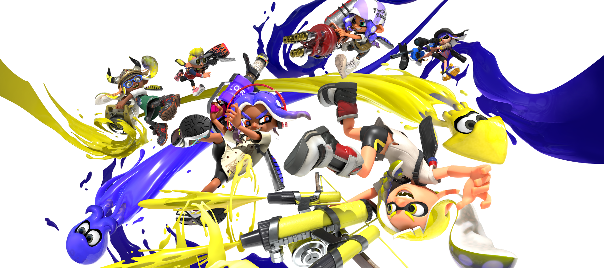
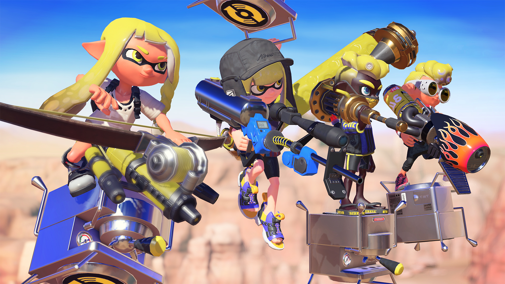
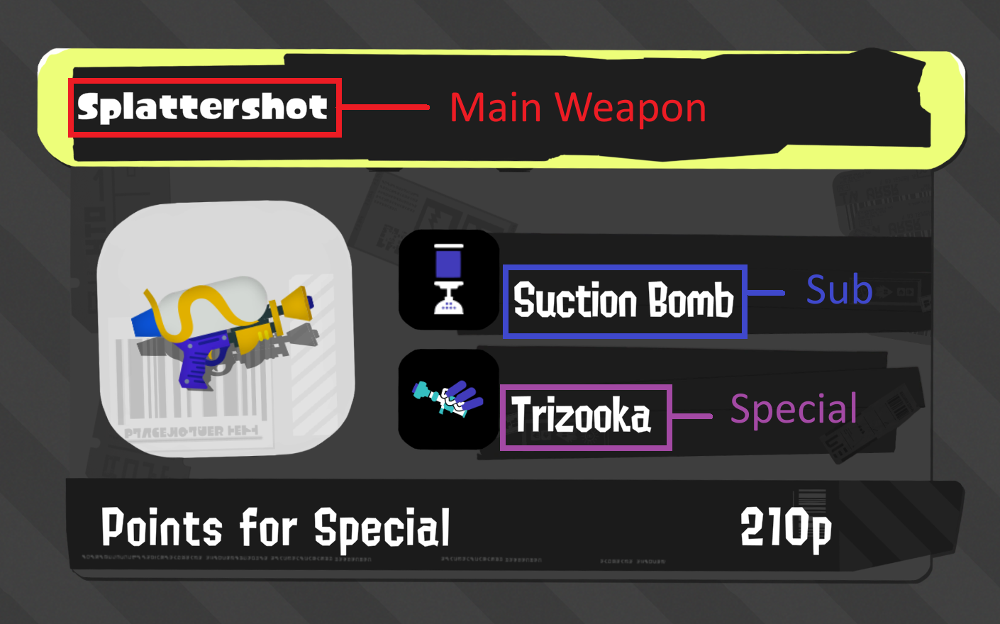
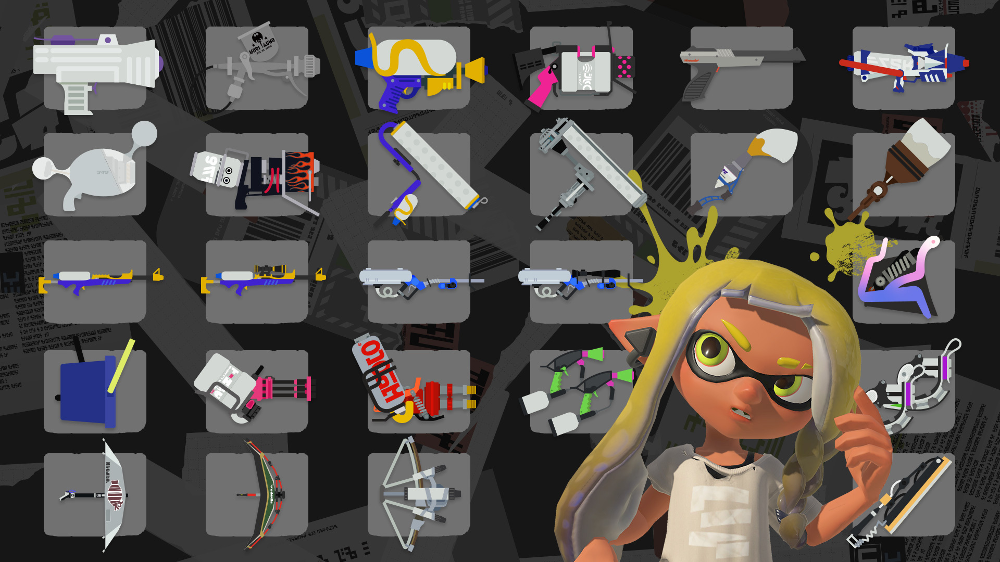

# Capstone Project: Splatoon Streamlit  



## Table of Contents

- [Capstone Project: Splatoon Streamlit](#capstone-project-splatoon-streamlit)
  - [Table of Contents](#table-of-contents)
  - [Introduction](#introduction)
  - [What is Splatoon?](#what-is-splatoon)
  - [Analysis](#analysis)
  - [Data sources:](#data-sources)
  - [User Stories](#user-stories)
  - [To do](#to-do)
    - [Extracting](#extracting)
    - [Transforming](#transforming)
    - [Loading](#loading)
    - [Streamlit](#streamlit)
  - [Final Streamlit App](#final-streamlit-app)
    - [Main page](#main-page)
    - [General page](#general-page)
    - [Main Weapons page](#main-weapons-page)
    - [Special Weapons page](#special-weapons-page)
    - [Special Weapons page](#special-weapons-page-1)
    - [Weapon Classes page](#weapon-classes-page)
  - [Results and findings](#results-and-findings)
  - [Future improvements](#future-improvements)
    - [Further Testing](#further-testing)
    - [Optimization](#optimization)
    - [Error Handling](#error-handling)
    - [Security and Privacy](#security-and-privacy)
    - [Deployed to the cloud](#deployed-to-the-cloud)
- [Running Instructions](#running-instructions)
    - [To run the ETL script (Do from root).](#to-run-the-etl-script-do-from-root)
    - [To run the Streamlit App (Must be inside app folder).](#to-run-the-streamlit-app-must-be-inside-app-folder)
    - [To run all tests (Do from root)](#to-run-all-tests-do-from-root)


## Introduction

I have chosen to base my capstone project on analyzing the strategies used by competitive players in **Splatoon 3**.  
As someone who plays the game casually, I have a very limited knowledge of the game's competitive scene.  
One area I am curious about is **gear builds**, which is what I will be focusing my analysis on.


## What is Splatoon?



**Splatoon** is an online multiplayer shooter developed by Nintendo.  
In this game, you play as either an Inkling or an Octoling in online 4v4 battles.  
There are multiple modes with the main casual mode being **Turf War** and the more competitive modes being **Splat Zones**, **Rainmaker**, **Tower Control**, and **Clam Blitz**.



The game has **11 weapon classes** and a total of **143 weapon kits** to choose from.  
Each main weapon comes with a predefined **sub weapon** and **special weapon**.  
There are **14 different sub weapons** and **19 different special weapons** in the game.


Along with choosing a weapon, players can also choose their **gear**, which includes headgear, clothing, and shoes.  
Each piece of gear comes with abilities that apply effects to help the player in battle, for example *"Run Speed Up"* increases a player's speed when running.

A majority of these abilities can be **stacked** to increase their effect.  
The effect of a stackable ability is tracked using **Ability Points (AP)**:  
- **Main ability** = 10 AP  
- **Sub ability** = 3 AP  

Non-stackable abilities usually have unique effects and only appear as the **main ability** on a specific gear piece (e.g., *Stealth Jump* only appears on shoes).

---

<p align="center">
  
  
</p>

---


## Analysis

My goal of this project is to perform analysis based on gear builds made by players. Gear builds are the set of gear a player designs with abilities suited for a specific weapon (with some also designed with certain game modes in mind). Different weapons have different strengths and weaknesses thus encouraging different play styles, this leads competitive players to create builds accordingly. For example having more ink saver main for weapons that run out of ink quickly. 

I will be focusing on analyzing the difference between gear builds used for different weapons (as well as between classes, subs and specials). I will be using the website sendou.ink as competitive players often use it to share their personal gear builds alongside what modes and weapons they use them for. I will also be using data from inkepedia to further enrich the build data collected from sendou. 

Examples of analytical questions I would like to answer by the end of the project:
- "What abilities should I use when playing my favorite weapon, the Dapple Dualies?"
- "what weapon class uses the most swim speed up?"
- "How much do builds differ between variants of the same weapon (same main but different sub and special)?

## Data sources:

[**sendou.ink**](https://sendou.ink)  
> "sendou.ink is a Splatoon resource website created by Sendou and others, and features tiering for higher-level competitive players, upcoming events, rotations, Splatoon gear builds and analysis, and more."  
> — [splatoonwiki.org](https://splatoonwiki.org/wiki/Competitive:Sendou#:~:text=ink,builds%20and%20analysis%2C%20and%20more.)

[**Inkepedia**](https://splatoonwiki.org/wiki/Main_Page)  
> A wiki made by fans which contains resources such as images and further information on individual weapons.


## User Stories

- **As a user**,  
  I want the app to gracefully handle network errors,  
  *so that it does not crash when loading images, for example.*

- **As a user**,  
  I want the extracted data that describes each weapon to be up-to-date,  
  *so that I can ensure the information stays accurate with future game updates.*

- **As a user**,  
  I want the data to exclude any repeated entries (such as weapon reskins),  
  *so that the dataset remains concise.*

- **As a user**,  
  I want the data to exclude builds consisting entirely of the same ability,  
  *so that the results aren't skewed by impractical builds.*

- **As a user**,  
  I want to be able to filter builds by weapon, weapon class, sub, and special,  
  *so that I can view commonly recommended abilities for each.*

- **As a user**,  
  I want to be able to filter builds by game mode,  
  *so that I can identify popular abilities per mode.*

- **As a user**,  
  I want to view visualizations for each weapon,  
  *so that I can easily spot correlations between weapons and frequently used abilities.*

## To do
### Extracting
1. Web scraping Sendou for weapon builds and store as a pandas data frame
    - should include columns for the main weapon name, the abilities used (mains and subs) and game modes
2. Web scraping Inkepedia for weapon details and store as multiple pandas data frames
    - one should include columns for main weapon name, sub weapon, special weapon, weapon class, special points
    - separate data frames for storing images for main weapons, weapon classes, sub weapons and special weapons 
    - separate data frame for storing ability images
3. These two data frames are to be combined during the data transformation stage
### Transforming
1. Cleaning
   - Remove impractical weapon builds, such as those which are of only one type of ability
   - for builds have 0 game modes listed, fill the missing values by making the builds generic to all modes 
   - Remove weapon repeats (weapons which are reskins of other weapons)
2. Standardize
   - Convert special points to numeric values
3. Aggregate
   - Change representation of abilities in the dataframe from Mains and Subs to individual ability columns
   - For trackable abilities calculate the APs
   - Calculate means for abilities across all builds
   - Calcualte means for abilities grouped by Weapon, Sub Weapon, Special Weapon and Weapon Class
   - Calculate total builds for different modes (also group by weapon)
4. Enrich
   - Add the weapon details to each weapon build
   - also add image urls for each weapon (main, sub, special and weapon class) 
### Loading
1. Produce output csvs for
    - Weapon builds
    - Weapon details
    - Any data frames created using aggregates

### Streamlit
1. Have a main page that filters by main weapon
2. Have filters fo different weapon classes, sub weapons, special weapons and modes
3. Display a bar chart for most common sub abilities and main abilities
4. Display a pie chart of game mode spread for a weapon (general vs mode specific)

If I have time I would also like to do some analysis on idividual abilities:
- what class/main weapon does each ability appear the most in
- If a build already has a main of one type of ability what is it most likely to be paired with (e.g. itself or a different one?)
- What are the most commonly used main abilities for headgear, clothing and shoes (to see the use of gear exclusive abilities)

## Final Streamlit App
I have created a streamlit app with the following:
### Main page 
- start page with title and side bar to move to other pages
### General page
- Displays the total number of builds
- 2 bar graphs describing the average build across all weapons
- The first detailing the average AP for each stackable ability
- The second detailing the percentage of builds that include each non-stackable ability
### Main Weapons page
- Allow you to filter build data by main weapon
- Can also filter by class to find weapons easier
- Shows general stats for that main weapon (Class, Sub Weapon, Special Weapon, Special Points, number of builds)
- Image of the main weapon, its sub and special
- 2 bar graphs same as in general page but they now change with weapon filtering to reflect the average build of that weapon
- Pie charts to show distribution of modes that builds were made for (How many include a specific mode, How many were only designed for a specific mode and how many modes were included)
### Special Weapons page
- Allow you to filter build data by special weapon
- Displays how many weapons use the special and how many builds too
- Shows an image of the special weapon icon
- 2 bar graphs same as in general but they now change with special weapon filtering, showing differences in averages based on special
### Special Weapons page
- Allow you to filter build data by sub weapon
- Displays how many weapons use the sub weapon and how many builds too
- Shows an image of the sub weapon icon
- 2 bar graphs same as in general but they now change with sub weapon filtering, showing differences in averages based on sub
### Weapon Classes page
- Allow you to filter build data by weapon class
- Displays how many weapons are the class
- Shows an image of the weapon class icon
- 2 bar graphs same as in general but they now change with weapon class filtering, showing differences in averages based on class

## Results and findings
Using this app the 3 questions I proposed at the beginning can be answered.
> Q1: **What abilities should I use when playing my favorite weapon, the Dapple Dualies?** 
 
By filtering on the main weapons page we can see that, for the dapple dualies, the abilities with the highest means for APs are
  - Sub Power Up (about 3 subs used on average per build)
  - Special Charge Up (about 2 subs used on average per build)
  - Quick Respawn (about 2 subs used on build per build)

and the two most used primary only abilities are

  - Stealth jump (63% of builds use it)
  - Comeback (56% of builds use it)
  
By looking at the averages for the dualie class we see that it is common for Quick Respawn, Stealth jump and Comeback to be used. However Special charge and sub power up are not nearly as popular overall. This is likely due to the dualies weapon kit of squid beacon and taticooler which greatly benefit from these abilities to work at their best. 

> Q3: **what weapon class uses the most swim speed up?**

Filtering by weapon class, we find that the classes that use the most swim speed up on average are

- Roller (about 1 main used per build)
- Brush (about 3 subs used per build)
- Charger (about 3 subs used per build)

Both roller and brush builds heavily favour swim speed over run speed this is because these weapons already have a fast means to run around (by rolling). Both Rollers and chargers mainly get around by inking a long path in front of them, making the additional swim speed up necessary for traveling long distances.

> Q2: **How much do builds differ between variants of the same weapon (same main but different sub and special)?**

A majority of weapons have very similar builds independent of what sub and special they have, though there are some notable differences relating to the sub and special, such as amount of sub power up, ink saver (sub), special power up and special charge up. An example is that when filtering builds by special weapon, weapons with tenta missiles tend to use much more special charge up than the average weapon. This is because as the special is one of the bests in the game.

## Future improvements
### Further Testing
Due to time constraints, I was only able to write unit tests for the extract portion of the project. Given more time I would like to write more unit tests for loading and component tests for transforming. Also some tests for functions used in the streamlit app.
### Optimization  
The ETL process already takes a fairly long time (about 10 minutes or more) to run. The longest part is the extraction as I am doing this by web scraping, as the websites used do not have APIs. To improve the speed of this I could implement parallel processing to process multiple pages at once. Could also refine the code to be more efficient with how data is obtained as currently a lot of loops are used and unnecessary pages accessed. For the transform part, in the event of the dataset increasing in size using pandas and CSVs may not be the best. I could switch to using pyspark instead of pandas and utilize pickling for loading dataframes.
### Error Handling
Currently my code has some tests which utilize error handling, for example tests for checking if a request to a website returns a 200 status code if not display and error. However this is an area which could be greatly improved on. Increasing the use of try and except blocks would help to prevent unknown errors from occurring, for example specifying if the error with loading is a file not found error. With logging this identification of errors would be easier and given how long the ETL process may take for larger datasets leaving the code to run with a logger would be a good idea.
### Security and Privacy
As I obtained the data from web scraping it is important to not scrape user data. The site I scraped from has the option for logging in via discord. This allows the developer(s) of sendou.ink to access to your username, email and more. Each build also comes with the discord username of the player who submitted it. While I did not include this data or anything similar in my project, I should either avoid collecting it or ensure that the data stored securely and that the storage of the data is legal.
### Deployed to the cloud
If this project was to be adapted to be in a cloud environment services such as AWS Glue and/or Lambda could be used to run the ETL. Amazon S3 could be used for storage of CSVs but also of high quality images to reduce the time taken to access the urls perhaps. Could also switch from using CSVs to database storage with the use Amazon Athena for SQL queries


# Running Instructions
### To run the ETL script (Do from root). 
```bash
run_etl dev
```

This will start the ETL process of web scraping and producing CSVs. These CSVs will be stored in file called Data.


### To run the Streamlit App (Must be inside app folder).

```bash
streamlit run main.py
```
 Data needed for the streamlit app are the CSVs created and located in the data folder (in the root) by the ETL script and the additional images/gifs stored in the data folder (in the app)


### To run all tests (Do from root)

```bash
run_tests all
```

