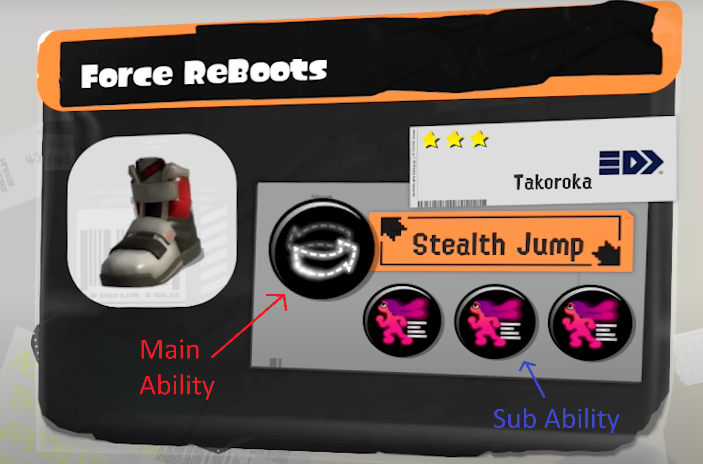
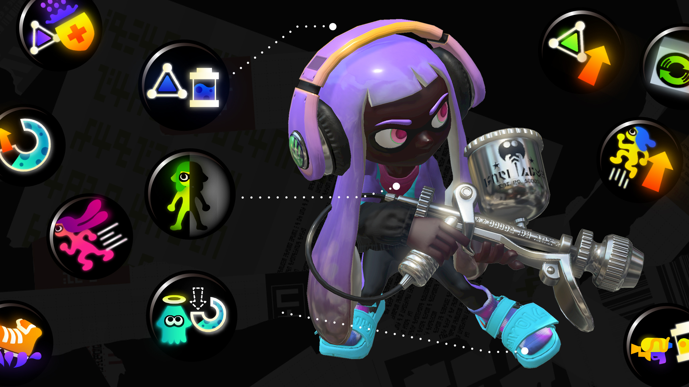

# Project Planning (Draft)

## The Project
I have chosen to base my capstone project on analyzing the strategies used by competitive players in Splatoon 3.
 As someone who plays the game casually I have a very limited knowledge of the game's competitive scene. One area I am curious about is gear builds, which is what I will be focusing my analysis on.

## What is Splatoon?

  
  

    Splatoon is an online multiplayer shooter developed by nintendo. In this game you play as either an inkling or an octoling in online 4v4 battles. There are multiple modes with the main casual mode being turf war and the more competitive modes being splat zones, rain maker, tower control and clam blitz.
  

  
  

    The game has 11 weapon classes and a total of 143 weapon kits to choose from where each main weapon comes with a predefined sub weapon and special weapon. There are 14 different sub weapons and 19 different special weapons in the game.
  

  
  

    

      Along with choosing a weapon, players can also choose their gear which includes headgear, clothing, and shoes. Each piece of gear comes with abilities which apply effects which can help the player in battle. For example, "Run Speed Up" increases the player's speed when running.
    

    

      A majority of these abilities can be stacked to increase their effect. The effect of a stackable ability is tracked with AP (Ability Points), with a main ability being worth 10 AP and a sub ability being worth 3 AP. Non-stackable abilities usually have a more unique effect and only appear as the main ability on one type of gear (for example, the ability "Stealth Jump" only appears on shoes).
    

  

  
  

## Analysis

My goal of this project is to perform analysis based on gear builds made by players. Gear builds are the set of gear a player designs with abilities suited for a specific weapon (with some also designed with certain game modes in mind). Different weapons have different strengths and weaknesses thus encouraging different play styles, this leads competitive players to create builds accordingly. For example having more ink saver main for weapons that run out of ink quickly. 

I will be focusing on analyzing the difference between gear builds used for different weapons (as well as between classes, subs and specials). I will be using the website sendou.ink as competitive players often use it to share their personal gear builds alongside what modes and weapons they use them for. I will also be using data from inkepedia to further enrich the build data collected from sendou. 

## Data sources:

[**sendou.ink**](https://sendou.ink)  
> "sendou.ink is a Splatoon resource website created by Sendou and others, and features tiering for higher-level competitive players, upcoming events, rotations, Splatoon gear builds and analysis, and more."  
> — [splatoonwiki.org](https://splatoonwiki.org/wiki/Competitive:Sendou#:~:text=ink,builds%20and%20analysis%2C%20and%20more.)

[**Inkepedia**](https://splatoonwiki.org/wiki/Main_Page)  
> A wiki made by fans which contains resources such as images and further information on individual weapons.

## User stories:
As a user,
I want the app to gracefully handle network errors,
so that it does not crash when loading images for example

As a user,
I want the extracted data which describes each weapon to be up-to-date,
so that I can ensure that with future game updates the information shown is accurate

As a user,
I want the data to not include any repeats (such as weapon reskins),
so that the data is concise

As a user,
I want the data to not include any builds that are all of the same ability,
so that the data is not skewed by impractical builds

As a user,
I want the to be able to filter builds by weapon, weapon class, sub and special
so that I can see what abilities are commonly recommended for each

As a user,
I want the to be able to filter builds by game mode
so that I can see what abilities are commonly recommended for each

As a user,
I want to be able to view visualizations for each weapon,
so that I can easily see correlations between the weapon and the most used abilities

