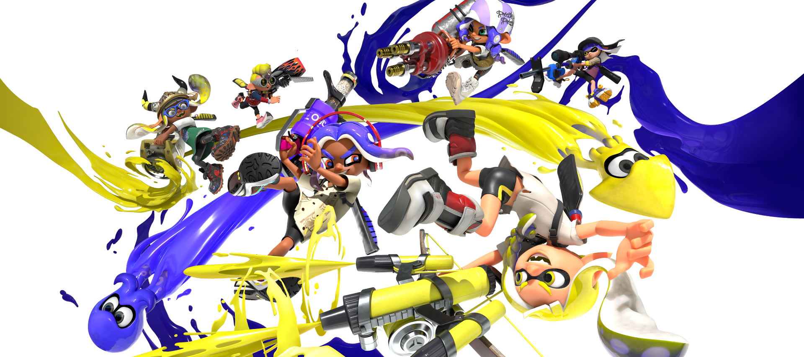
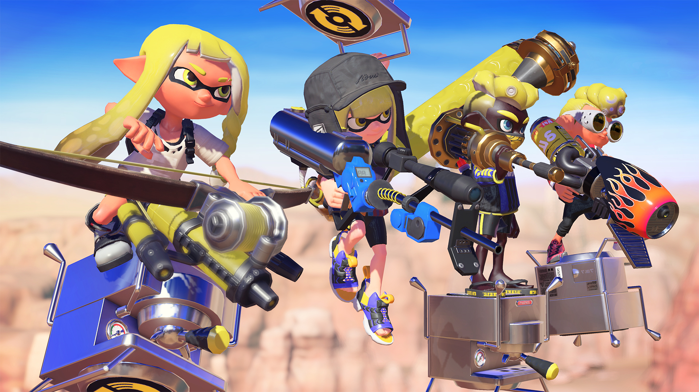
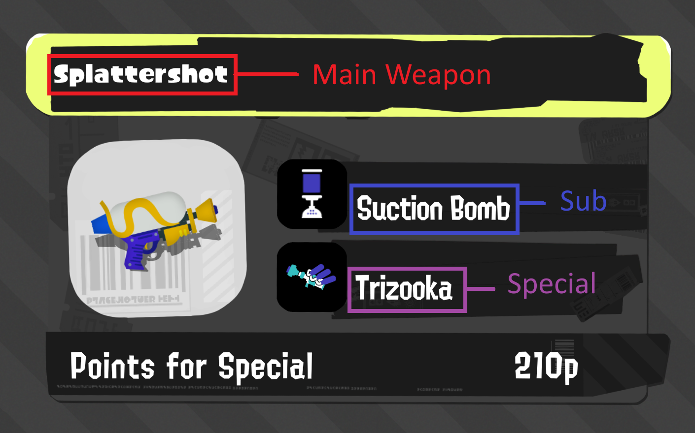
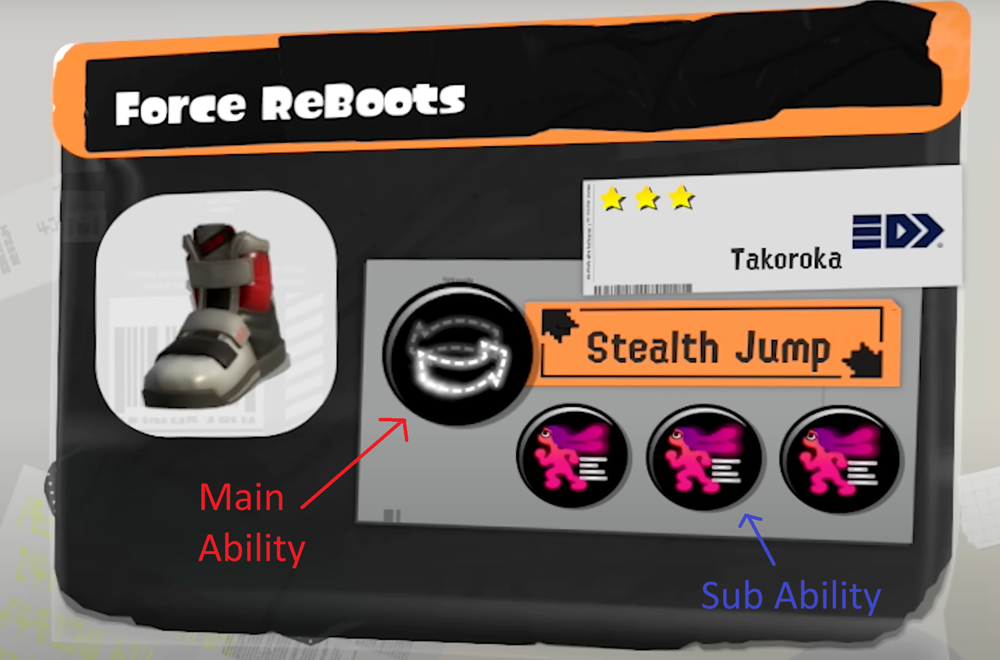
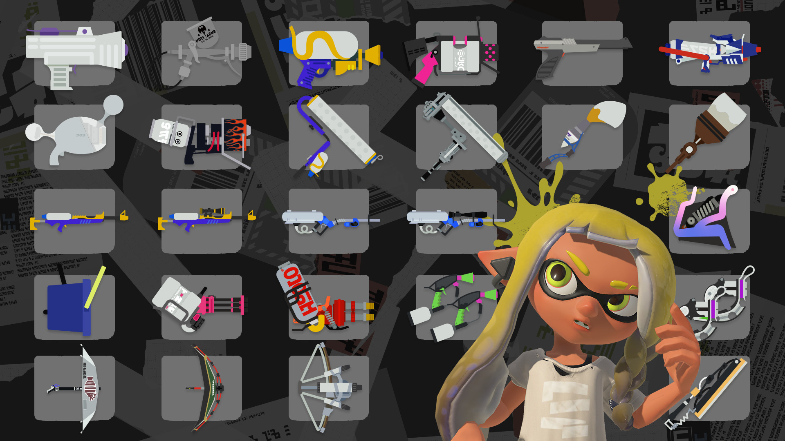
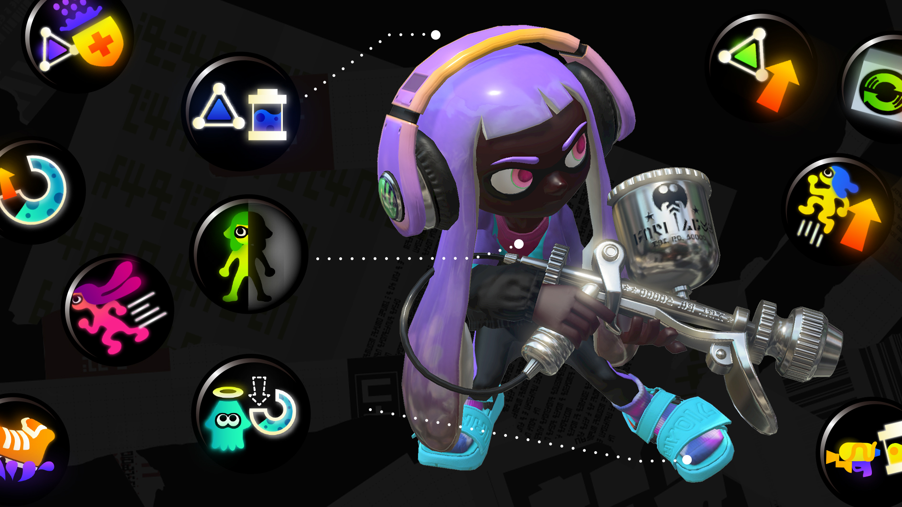

# Capstone Project: Splatoon Streamlit 

## Introduction

I have chosen to base my capstone project on analyzing the strategies used by competitive players in **Splatoon 3**.  
As someone who plays the game casually, I have a very limited knowledge of the game's competitive scene.  
One area I am curious about is **gear builds**, which is what I will be focusing my analysis on.

## What is Splatoon?

**Splatoon** is an online multiplayer shooter developed by Nintendo.  
In this game, you play as either an Inkling or an Octoling in online 4v4 battles.  
There are multiple modes with the main casual mode being **Turf War** and the more competitive modes being **Splat Zones**, **Rainmaker**, **Tower Control**, and **Clam Blitz**.

The game has **11 weapon classes** and a total of **143 weapon kits** to choose from.  
Each main weapon comes with a predefined **sub weapon** and **special weapon**.  
There are **14 different sub weapons** and **19 different special weapons** in the game.

Along with choosing a weapon, players can also choose their **gear**, which includes headgear, clothing, and shoes.  
Each piece of gear comes with abilities that apply effects to help the player in battle, for example *"Run Speed Up"* increases a player's speed when running.

A majority of these abilities can be **stacked** to increase their effect.  
The effect of a stackable ability is tracked using **Ability Points (AP)**:  
- **Main ability** = 10 AP  
- **Sub ability** = 3 AP  

Non-stackable abilities usually have unique effects and only appear as the **main ability** on a specific gear piece (e.g., *Stealth Jump* only appears on shoes).

---

  
  

---

## Analysis

My goal of this project is to perform analysis based on gear builds made by players. Gear builds are the set of gear a player designs with abilities suited for a specific weapon (with some also designed with certain game modes in mind). Different weapons have different strengths and weaknesses thus encouraging different play styles, this leads competitive players to create builds accordingly. For example having more ink saver main for weapons that run out of ink quickly. 

I will be focusing on analyzing the difference between gear builds used for different weapons (as well as between classes, subs and specials). I will be using the website sendou.ink as competitive players often use it to share their personal gear builds alongside what modes and weapons they use them for. I will also be using data from inkepedia to further enrich the build data collected from sendou. 

Examples of analytical questions I would like to answer by the end of the project:
- "What abilities should I use when playing my favorite weapon, the Dapple Dualies?"
- "what weapon class uses the most swim speed up?"
- "How much do builds differ between variants of the same weapon (same main but different sub and special)?
- "Comparing rainmaker only builds to general builds is there a noticeable difference in the amount of object shredder used? (as the rainmaker shield is an object)"

## Data sources:

[**sendou.ink**](https://sendou.ink)  
> "sendou.ink is a Splatoon resource website created by Sendou and others, and features tiering for higher-level competitive players, upcoming events, rotations, Splatoon gear builds and analysis, and more."  
> — [splatoonwiki.org](https://splatoonwiki.org/wiki/Competitive:Sendou#:~:text=ink,builds%20and%20analysis%2C%20and%20more.)

[**Inkepedia**](https://splatoonwiki.org/wiki/Main_Page)  
> A wiki made by fans which contains resources such as images and further information on individual weapons.

## User Stories

- **As a user**,  
  I want the app to gracefully handle network errors,  
  *so that it does not crash when loading images, for example.*

- **As a user**,  
  I want the extracted data that describes each weapon to be up-to-date,  
  *so that I can ensure the information stays accurate with future game updates.*

- **As a user**,  
  I want the data to exclude any repeated entries (such as weapon reskins),  
  *so that the dataset remains concise.*

- **As a user**,  
  I want the data to exclude builds consisting entirely of the same ability,  
  *so that the results aren't skewed by impractical builds.*

- **As a user**,  
  I want to be able to filter builds by weapon, weapon class, sub, and special,  
  *so that I can view commonly recommended abilities for each.*

- **As a user**,  
  I want to be able to filter builds by game mode,  
  *so that I can identify popular abilities per mode.*

- **As a user**,  
  I want to view visualizations for each weapon,  
  *so that I can easily spot correlations between weapons and frequently used abilities.*

## To do
### Extracting
1. Web scraping Sendou for weapon builds and store as a pandas data frame
    - should include columns for the main weapon name, the abilities used (mains and subs) and game modes
2. Web scraping Inkepedia for weapon details and store as multiple pandas data frames
    - one should include columns for main weapon name, sub weapon, special weapon, weapon class, special points
    - separate data frames for storing images for main weapons, weapon classes, sub weapons and special weapons 
    - separate data frame for storing ability images
3. These two data frames are to be combined during the data transformation stage
### Transforming
1. Cleaning
   - Remove impractical weapon builds, such as those which are of only one type of ability
   - for builds have 0 game modes listed, fill the missing values by making the builds generic to all modes 
   - Remove weapon repeats (weapons which are reskins of other weapons)
2. Standardize
   - Convert special points to numeric values
   - Convert the lists of game modes to true and false columns for each mode
3. Aggregate
   - Create a data frame that for each main weapon calculates the average amount of subs of each ability
   - Create a data frame that for each main weapon calculates the average amount of mains of each ability
   - (Can go further by calculating the average AP points for each stackable ability including subs and mains)
4. Enrich
   - Add the weapon details to each weapon build
   - also add image urls for each weapon (main, sub, special and weapon class) 
### Loading
1. Produce output csvs for
    - Weapon builds
    - Weapon details
    - Any data frames created using aggregates

### Streamlit
1. Have a main page that filters by main weapon
2. Have filters fo different weapon classes, sub weapons, special weapons and modes
3. Display a bar chart for most common sub abilities and main abilities
4. Display a pie chart of game mode spread for a weapon (genera vs mode specific)

If I have time I would also like to do some analysis on idividual abilities:
- what class/main weapon does each ability appear the most in
- If a build already has a main of one type of ability what is it most likely to be paired with (e.g. itself or a different one?)
- What are the most commonly used main abilities for headgear, clothing and shoes (to see the use of gear exclusive abilities)